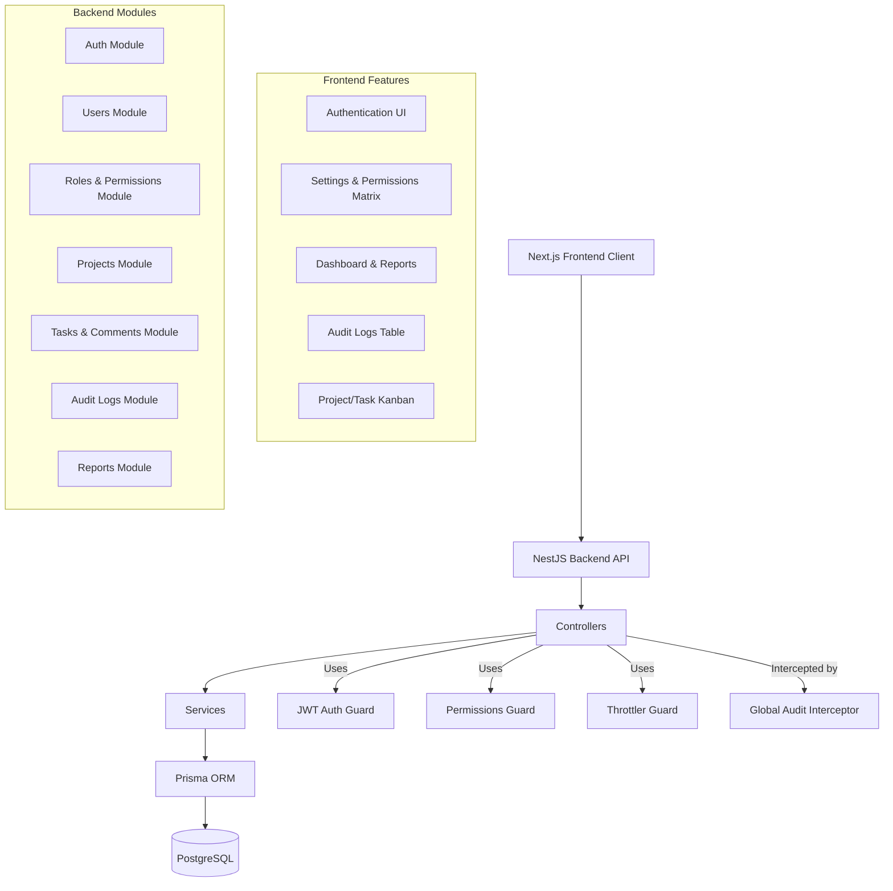

# System Architecture

## Architecture Diagram

## Design Details
- **Frontend Client:** Built as a Single Page Application (SPA) using Next.js (App Router). Global application state is managed using `Zustand` and server-state/caching is handled with `TanStack Query`. Component styling is implemented via Tailwind CSS.
- **Backend API:** Monolithic structure designed with NestJS modules to enforce separation of concerns. Prisma ORM is used for database modeling and query execution.
- **Cross-Cutting Concerns:** 
  - Rate limiting is handled on the API gateway/controller level via `@nestjs/throttler`.
  - Auditing is implemented asynchronously through a global `AuditInterceptor` that catches write mutations (`POST`, `PUT`, `PATCH`, `DELETE`) and registers logs.
