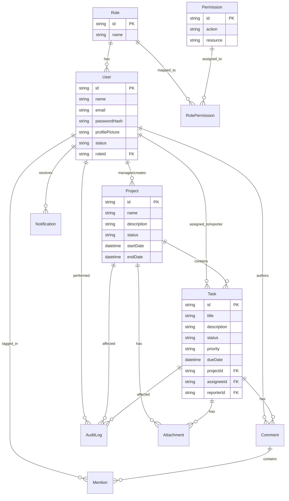

# Entity Relationship Diagram

```mermaid
erDiagram
    Role ||--o{ User : has
    Role ||--o{ RolePermission : mapped_to
    Permission ||--o{ RolePermission : assigned_to

    User ||--o{ Project : "manages/creates"
    User ||--o{ Task : "assigned_to/reporter"
    User ||--o{ Comment : "authors"
    User ||--o{ AuditLog : "performed"
    User ||--o{ Notification : "receives"
    User ||--o{ Mention : "tagged_in"

    Project ||--o{ Task : "contains"
    Project ||--o{ Attachment : "has"
    Project ||--o{ AuditLog : "affected"

    Task ||--o{ Comment : "has"
    Task ||--o{ Attachment : "has"
    Task ||--o{ AuditLog : "affected"
    
    Comment ||--o{ Mention : "contains"

    User {
        string id PK
        string name
        string email
        string passwordHash
        string profilePicture
        string status
        string roleId FK
    }

    Role {
        string id PK
        string name
    }

    Permission {
        string id PK
        string action
        string resource
    }

    Project {
        string id PK
        string name
        string description
        string status
        datetime startDate
        datetime endDate
    }

    Task {
        string id PK
        string title
        string description
        string status
        string priority
        datetime dueDate
        string projectId FK
        string assigneeId FK
        string reporterId FK
    }
```
